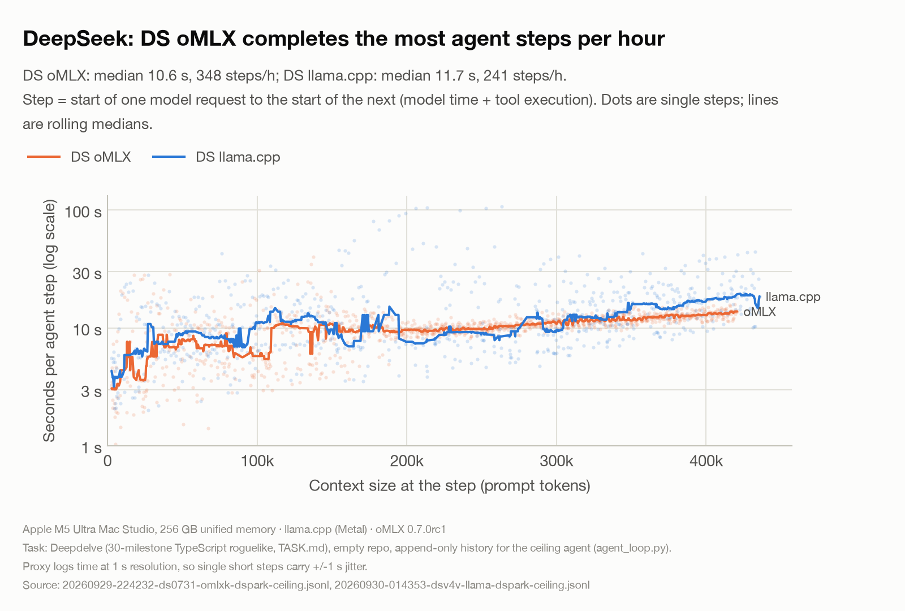
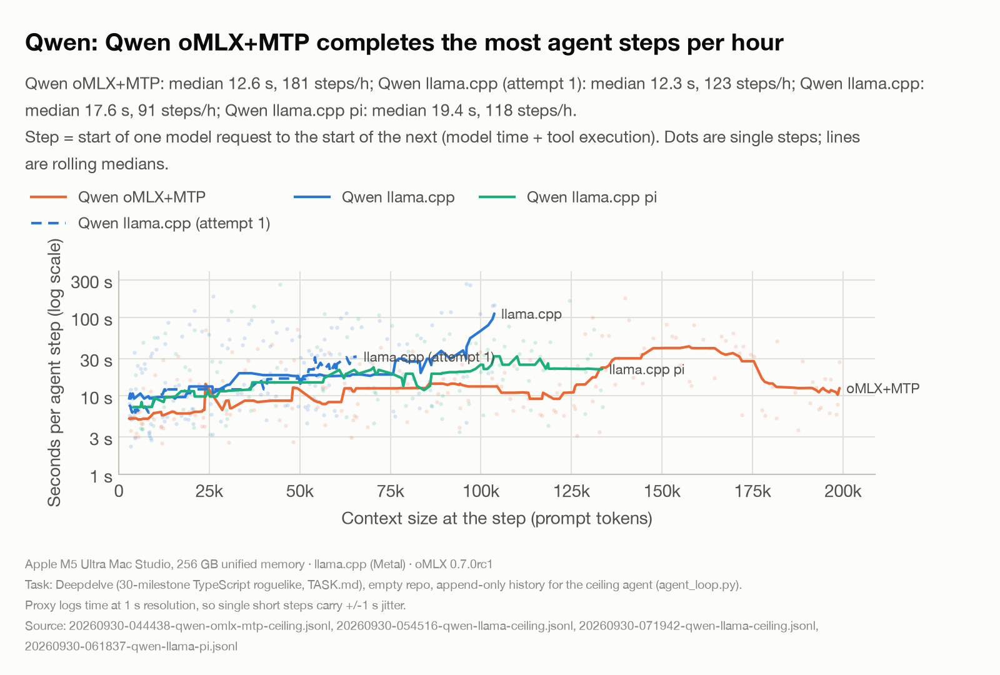
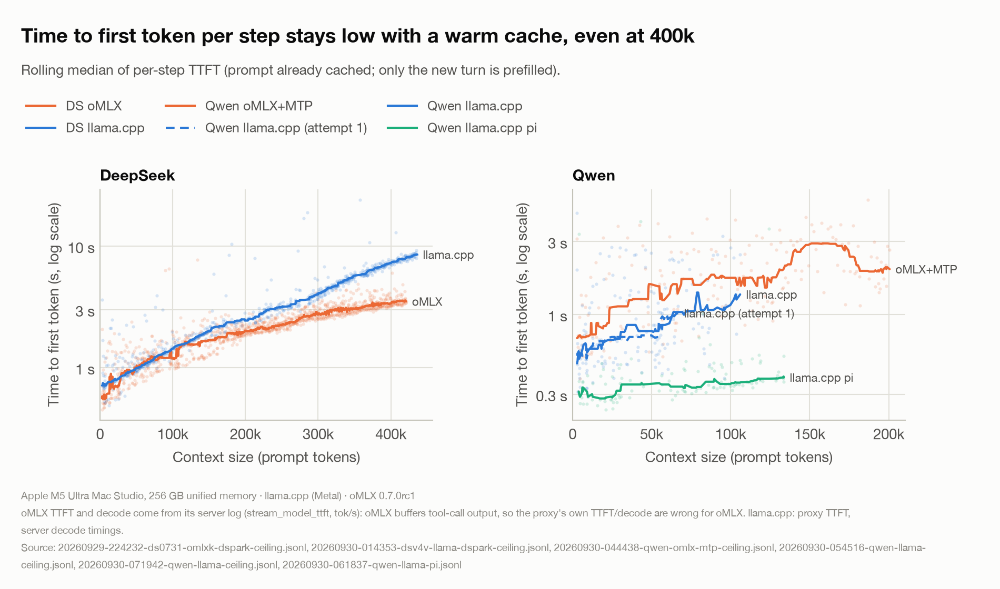
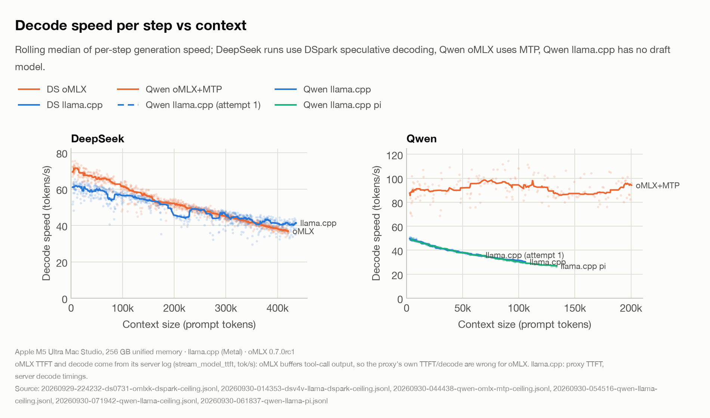
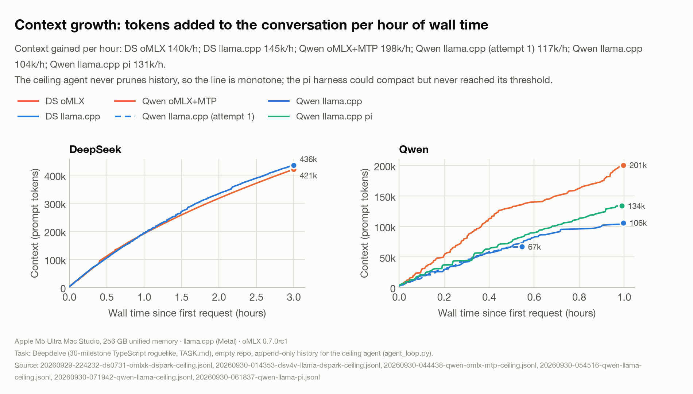
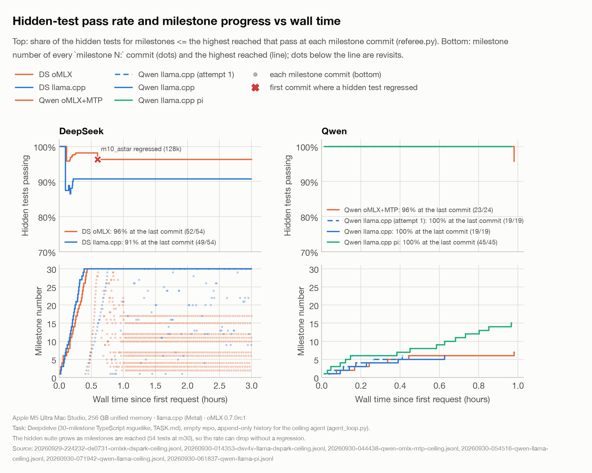
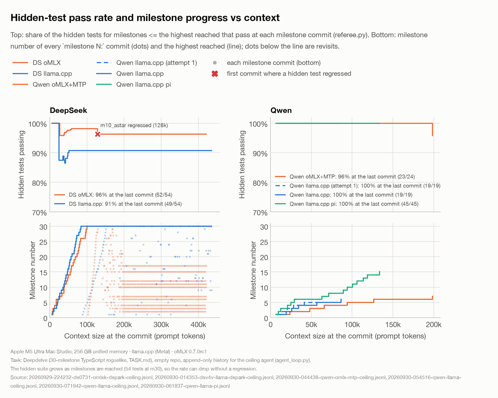
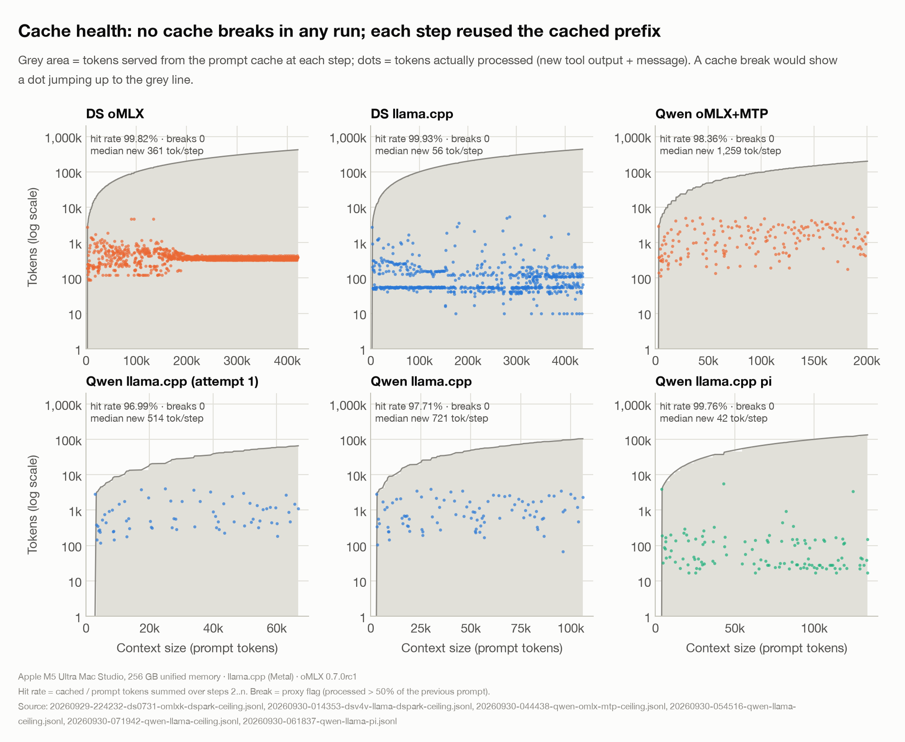

# Overnight agentic benchmark: morning report

Generated 2026-09-30 08:20 by `make_report.py` from the proxy, server, transcript, git and referee logs. Mac Studio M5 Ultra, 256 GB. Task: Deepdelve (TASK.md): a 30-milestone TypeScript roguelike built from an empty repo, one `milestone N:` commit per milestone.

Runs: **DS oMLX** = DeepSeek V4 Flash 0731, oMLX kernel build + DSpark, ceiling agent; **DS llama.cpp** = DeepSeek V4 Flash Vision-Exp, llama.cpp + DSpark, ceiling agent; **Qwen oMLX+MTP** = Qwen3.8-Flash-Next, oMLX + MTP, ceiling agent; **Qwen llama.cpp** = Qwen3.8-Flash-Next, llama.cpp (no MTP), ceiling agent; **Qwen llama.cpp pi** = Qwen3.8-Flash-Next, llama.cpp (no MTP), pi agent.

## 1. Summary

| Run | Status | Requests | Final context | Wall time | Cache breaks | Step median / p90 | Steps/h | Output tok/h | Context gained/h | Watchdog nudges | Milestone commits | Highest milestone (first reached) | Hidden tests (latest) | Agent tests (latest) |
|---|---|---|---|---|---|---|---|---|---|---|---|---|---|---|
| **DS oMLX** | time cap | 1,044 | 421,098 | 3h00 | 0 | 10.6 / 13.5 s | 348 | 102,930 | 139,538 | 0 | 796 | m30 (0h26) | 52/54 (96%) | 973/973 |
| **DS llama.cpp** | time cap | 722 | 436,001 | 3h00 | 0 | 11.7 / 25.1 s | 241 | 116,094 | 144,534 | 0 | 168 | m30 (0h23) | 49/54 (91%) | 329/329 |
| **Qwen oMLX+MTP** | time cap | 181 | 200,578 | 1h00 | 0 | 12.6 / 46.0 s | 181 | 278,113 | 198,334 | 1 | 7 | m7 (0h59) | 23/24 (96%) | 278/278 |
| **Qwen llama.cpp (attempt 1)** | agent finished; HTTP 500 at request 68 | 68 | 66,780 | 0h33 | 0 | 12.3 / 68.2 s | 123 | 136,821 | 117,062 | 0 | 6 | m6 (0h25) | 19/19 (100%) | 110/110 |
| **Qwen llama.cpp** | time cap | 91 | 106,022 | 1h00 | 0 | 17.6 / 92.7 s | 91 | 123,877 | 103,510 | 0 | 6 | m6 (0h38) | 19/19 (100%) | 136/136 |
| **Qwen llama.cpp pi** | time cap | 117 | 133,686 | 0h59 | 0 | 19.4 / 62.2 s | 118 | 119,689 | 131,131 | n/a (pi) | 16 | m15 (0h58) | 45/45 (100%) | 154/154 |

Step = start of one model request to the start of the next (model + tool time). Wall time = first request to last response. Time caps were 3 h (DeepSeek) and 1 h (Qwen).

### Median TTFT and decode speed by context band

Cells: median TTFT (s) / median decode (tok/s) / requests. oMLX values from its server log (`stream_model_ttft`, `tok/s`), matched to proxy rows by order and prompt size; llama.cpp from the proxy TTFT and the server `timings`.

| Run | 0-50k | 50-100k | 100-200k | 200-300k | 300k+ | LLM time/step (median) | Spec-decode acceptance |
|---|---|---|---|---|---|---|---|
| DS oMLX | 0.77 / 68.7 / 102 | 1.17 / 64.4 / 97 | 1.74 / 54.3 / 228 | 2.32 / 48.4 / 278 | 3.21 / 40.8 / 339 | 8.4 s | 96% |
| DS llama.cpp | 0.87 / 60.1 / 90 | 1.21 / 57.1 / 89 | 1.89 / 54.1 / 131 | 3.19 / 46.0 / 131 | 6.19 / 42.2 / 281 | 10.3 s | 91% |
| Qwen oMLX+MTP | 0.88 / 90.0 / 53 | 1.58 / 96.7 / 42 | 2.04 / 89.7 / 84 | 2.64 / 96.0 / 1 | – | 12.3 s | 84% |
| Qwen llama.cpp (attempt 1) | 0.62 / 44.6 / 49 | 0.97 / 36.7 / 18 | – | – | – | 11.8 s | none (no draft model) |
| Qwen llama.cpp | 0.69 / 45.2 / 43 | 0.87 / 34.4 / 44 | 1.85 / 29.5 / 4 | – | – | 16.7 s | none (no draft model) |
| Qwen llama.cpp pi | 0.32 / 43.6 / 43 | 0.35 / 32.8 / 42 | 0.37 / 28.4 / 32 | – | – | 17.6 s | none (no draft model) |

### Code quality (referee.py, per milestone commit)

| Run | Referee'd commits | Hidden pass @0.5h / 1h / 2h / 3h | Regressions (test, first at ctx) | Commits flagged w/ regression | Test-count drops | skip/only added | Test files deleted | History rewrites | Build failures | Agent-test failures |
|---|---|---|---|---|---|---|---|---|---|---|
| DS oMLX | 796 | 98% / 96% / 96% / 96% | `m10_astar.test.ts` m10 A* pathfinding finds optimal paths (length equals BFS di (at 128k, 724 commits, still failing) | 724 | 0 | 0 | 0 | 0 | 10/796 | 15/796 |
| DS llama.cpp | 168 | 91% / 91% / 91% / 91% | none | 0 | 232→217 at 219k (milestone 26: Achievements (game loop in) | 0 | 0 | 0 | 10/168 | 6/168 |
| Qwen oMLX+MTP | 7 | 100% / 96% / · / · | none | 0 | 0 | 0 | 0 | 0 | 0/7 | 0/7 |
| Qwen llama.cpp (attempt 1) | 7 | 100% / · / · / · | none | 0 | 0 | 0 | 0 | 1 | 1/7 | 0/7 |
| Qwen llama.cpp | 6 | 100% / 100% / · / · | none | 0 | 0 | 0 | 0 | 0 | 0/6 | 0/6 |
| Qwen llama.cpp pi | 16 | 100% / 100% / · / · | none | 0 | 0 | 0 | 0 | 0 | 1/16 | 1/16 |

| Run | src LOC (files) | test LOC (files) | Milestone commits: backward jumps / repeats of a number | Test-only milestone commits | Distinct milestones/h | Milestone commits/h | Hidden tests failing at the end |
|---|---|---|---|---|---|---|---|
| DS oMLX | 3,130 (37) | 9,322 (34) | 356 / 766 | 740 of 796 | 10.0 | 265.5 | `m07_fov` m07 fov lights the walls of a room but not what li, `m10_astar` m10 A* pathfinding finds optimal paths (length equ |
| DS llama.cpp | 4,274 (49) | 3,239 (48) | 38 / 138 | 16 of 168 | 10.0 | 56.0 | `m07_fov` m07 fov a pillar casts a shadow, `m07_fov` m07 fov lights the walls of a room but not what li, `m07_fov` m07 fov sees down a straight corridor but not arou, `m11_scheduler` m11 scheduler turn frequency is proportional to sp, `m12_combat` m12 combat both hits and misses happen, and hits u |
| Qwen oMLX+MTP | 3,831 (22) | 2,956 (14) | 0 / 0 | 0 of 7 | 7.0 | 7.0 | `m07_fov` m07 fov lights the walls of a room but not what li |
| Qwen llama.cpp (attempt 1) | 2,435 (13) | 1,201 (8) | 0 / 0 | 0 of 6 | 11.0 | 11.0 | none |
| Qwen llama.cpp | 2,619 (11) | 1,705 (10) | 0 / 0 | 0 of 6 | 6.0 | 6.0 | none |
| Qwen llama.cpp pi | 2,680 (22) | 1,850 (19) | 0 / 1 | 1 of 16 | 15.2 | 16.2 | none |

## 2. Charts

**(a) Seconds per agent step vs context, DeepSeek pair**



**(a) Seconds per agent step vs context, Qwen trio**



**(b) Time to first token per step vs context**



**(c) Decode speed per step vs context**



**(d) Cumulative context vs wall time**



**(e) Hidden-test pass rate and milestone progress vs wall time**



**(e) Hidden-test pass rate and milestone progress vs context**



**(f) Cached vs processed tokens per step (cache health)**



## 3. Findings

- **DeepSeek: oMLX wins steps/hour (348 vs 244) and median step latency; milestone pace is a near tie (m30 after 0h26 vs 0h23).** Compared up to the context both reached (421k; DS llama.cpp): DS oMLX got there in 3h00 (1044 steps, median step 10.6 s, median LLM time 8.4 s, 246 output tok/step, milestone m30), DS llama.cpp in 2h50 (691 steps, median step 11.2 s, median LLM time 10.0 s, 278 output tok/step, m30). Whole runs: 348 vs 241 steps/h, 103k vs 116k output tok/h, 140k vs 145k context/h, 10.0 vs 10.0 distinct milestones/h. Per-request engine speed (oMLX vs llama.cpp), 0-50k: TTFT 0.77 vs 0.87 s, decode 69 vs 60 tok/s; 300k+: TTFT 3.21 vs 6.19 s, decode 41 vs 42 tok/s. Caveats: the pair differs in model variant (0731 vs Vision-Exp) and quant as well as engine, and the workloads diverged: after ~191k DS oMLX was in a one-test-per-step loop (short outputs), which flatters its steps/h; its 265 milestone commits/h (vs 56) are not progress.
- **Qwen: oMLX wins steps/hour (258 vs 91) and median step latency; oMLX reached m6 first (0h27 vs 0h38).** Compared up to the context both reached (106k; Qwen llama.cpp): Qwen oMLX+MTP got there in 0h23 (99 steps, median step 8.4 s, median LLM time 7.1 s, 508 output tok/step, milestone m5), Qwen llama.cpp in 1h00 (91 steps, median step 17.6 s, median LLM time 16.7 s, 565 output tok/step, m6). Whole runs: 181 vs 91 steps/h, 278k vs 124k output tok/h, 198k vs 104k context/h, 7.0 vs 6.0 distinct milestones/h. Per-request engine speed (oMLX vs llama.cpp), 0-50k: TTFT 0.88 vs 0.69 s, decode 90 vs 45 tok/s; 100-200k: TTFT 2.04 vs 1.85 s, decode 90 vs 29 tok/s.
- **pi vs the ceiling agent (Qwen, llama.cpp).** pi: 118 requests/h, median step 19.4 s, 662 tok context growth and 529 output tok per step, 131k context/h, m15 at 134k (11.2 milestones per 100k context) with hidden tests 45/45, tools {'bash': 54, 'write': 52, 'edit': 46, 'read': 2}. Qwen llama.cpp (attempt 1): 123 steps/h, median step 12.3 s, 510 tok context growth and 460 output tok per step, 117k context/h, m6 at 67k (9.0 milestones per 100k context), tools {'run': 43, 'write_file': 30}. Qwen llama.cpp: 91 steps/h, median step 17.6 s, 717 tok context growth and 565 output tok per step, 104k context/h, m6 at 106k (5.7 milestones per 100k context), tools {'run': 60, 'write_file': 38}. pi's steps are longer and produce more output (it has its own system prompt and uses `edit` for in-place changes, 46 of 154 tool calls, where the ceiling agent rewrites whole files with write_file), and it made more milestone progress per 100k tokens of context than the completed ceiling attempt. Cache behaviour: pi hit rate 99.76%, 0 breaks, 0 history edits (the proxy saw pi's history as append-only), 1 harness invocation, 0 compaction events in harness.log (pi compacts at 262k - 16k reserve, never reached).
- **Code quality.** DS oMLX: 52/54 hidden at m30 (failing: astar, fov), 10/796 milestone commits failed the build, 15 failed their own tests, 3,130 src / 9,322 test LOC; DS llama.cpp: 49/54 hidden at m30 (failing: combat, fov, scheduler), 10/168 milestone commits failed the build, 6 failed their own tests, 4,274 src / 3,239 test LOC; Qwen oMLX+MTP: 23/24 hidden at m7 (failing: fov), 0/7 milestone commits failed the build, 0 failed their own tests, 3,831 src / 2,956 test LOC; Qwen llama.cpp (attempt 1): 19/19 hidden at m6 (all pass), 1/7 milestone commits failed the build, 0 failed their own tests, 2,435 src / 1,201 test LOC; Qwen llama.cpp: 19/19 hidden at m6 (all pass), 0/6 milestone commits failed the build, 0 failed their own tests, 2,619 src / 1,705 test LOC; Qwen llama.cpp pi: 45/45 hidden at m15 (all pass), 1/16 milestone commits failed the build, 1 failed their own tests, 2,680 src / 1,850 test LOC. skip/only markers added: 0; test files deleted: 0. DS oMLX and DS llama.cpp declared all 30 milestones done in under 45 minutes, so the implementations are thin (the hidden FOV tests fail in both); Qwen is several times slower per milestone but its code passes nearly every hidden test for the milestones it reached. 

### Anomalies

- **Qwen llama.cpp (attempt 1) crashed** after 67 good requests (0h33, 66,780 context, highest m6): request 67 produced 8,192 output tokens (the max_tokens cap) and was cut off inside a tool call; the truncated arguments were not valid JSON, and when agent_loop sent them back llama.cpp refused to render the history (HTTP 500, "Failed to parse tool call arguments as JSON"). agent_loop retried and then exited. Fixed since (arguments stored as `{}`, error returned to the model). The event log's `last ctx 0` is the failed row. Rerun started 07:19.
- **History rewrite (Qwen llama.cpp (attempt 1)):** at 06:02 HEAD stopped descending from the previously seen HEAD; lost milestone commit(s): m5 (the build-failing milestone commit was replaced by an amended one; no tests were lost).
- **DS oMLX: degenerate one-test loop.** From step 403 (context 191k, 1h00 into the run) to the end (step 1044), 636 of 1044 steps (61%) open with the same sentence, "Let me continue extending. Let me add a `…` test for the buy and a `…`…". Each such step appends one trivial test to an existing test file, runs test + build and commits it as `milestone N: <x> test`, and by the end it cycles through the same 10 milestone numbers (4, 3, 15, 2, 12, 7, 6, 10, 11, 17), so e.g. "milestone 15" is followed by "milestone 2". It keeps announcing a `shop` test; none was ever written. After the first pass reached m30 at 0h26, 736 of 756 milestone commits touched only test files; the last commit to change src/ was 'milestone 5: render stairs glyph' at 23:27. Result: 796 milestone commits and 973 agent tests, while the hidden pass rate stayed at 96%. The watchdog never fired, because each step has different arguments and makes a new milestone commit; neither trigger (4 identical calls, 40 steps without a milestone commit) can catch it.
- **DS llama.cpp: out-of-order second pass.** After m30 at 0h23 it restarted at m1 to extend each system, as TASK.md asks, then drifted into jumping between milestones (38 backward jumps, 138 commits reusing a number), with a `milestone 30: … (changelog update)` commit every few features. Real src changes continued (16 of 168 commits were test-only). Test-count drop(s): 232→217 at 219k ('milestone 26: Achievements (game loop integration)').
- **Regression (DS oMLX):** `m10_astar.test.ts::m10 A* pathfinding finds optimal paths (length equals BFS distance) on 200 random maps` first failed at 0h36 (context 128k) in 'milestone 28: optimize A* with binary heap', and stayed failing in 724 commits to the end of the run.
- **oMLX measurement caveat:** oMLX buffers tool-call output, so the proxy sees the first byte only once the whole tool call is done. 170 of 1224 oMLX proxy rows show decode above 1,000 tok/s (max 2,592,637), and the proxy's median TTFT is 2.96 s vs 2.19 s in the server log. Every oMLX TTFT/decode number here comes from the server log (1224 of 1224 rows matched by order and prompt size); total_s and step times are valid for all runs.
- **The live referee watched the wrong workspace for Qwen llama.cpp.** run_overnight starts `referee.py --watch` on the newest `runs/*-qwen-llama-ceiling` directory; at that moment it was still `20260930-054519-qwen-llama-ceiling` (the rerun created its own a few seconds later), so the watcher re-polled the old repo. This run is only covered by the end-of-run referee pass.
- **Replies cut at max_tokens (8192):** Qwen oMLX+MTP: 1, Qwen llama.cpp (attempt 1): 1, Qwen llama.cpp: 1, Qwen llama.cpp pi: 1.
- **Watchdog nudges:** Qwen oMLX+MTP step 159 at 175k (no new milestone commit in the last 40 steps), while working on m7, which took 0h32.

## Regenerate

```
python report/make_report.py
```

Pure file reading (plus a one-shot `referee.py` for any finished run that has no referee output); never contacts a model server. Run it again after `qwen-llama-ceiling` ends (~08:25) so its final numbers and the referee's end-of-run pass are included.
